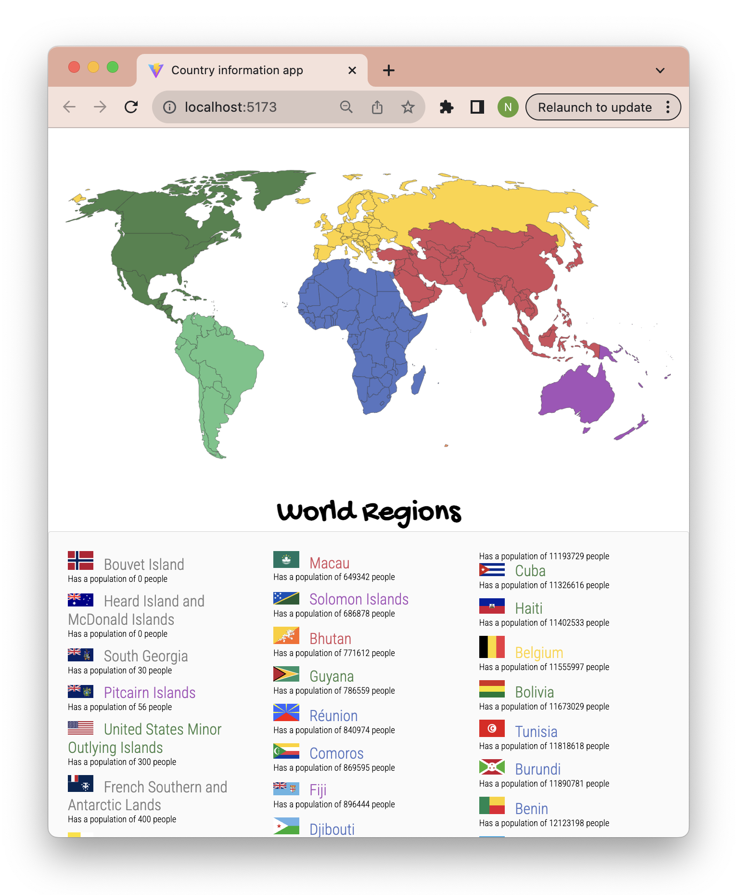
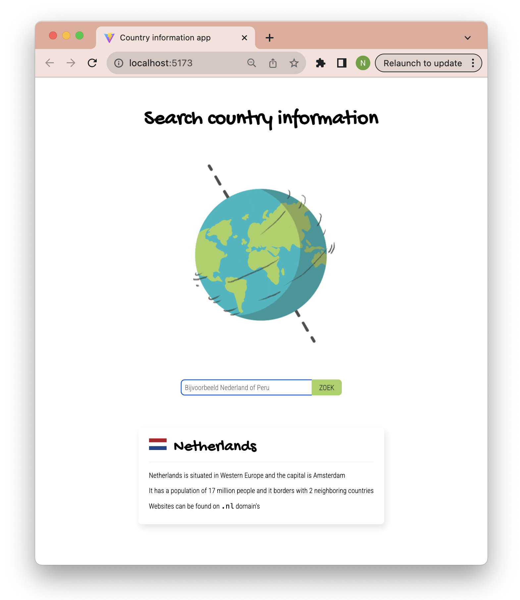

# Opdrachtbeschrijving

## Inleiding

Je vrienden hebben er inmiddels lucht van gekregen dat je kunt programmeren en sindsdien wordt je low key gestalkt met
verzoekjes om webapplicaties te bouwen. Je vriend Constantijn wil heel graag dat je een applicatie voor hem maakt die
feitjes over landen kan ophalen, zodat hij cool kan doen met zijn wereldse kennis op borrels en verjaardagen.

Je gaat dit doen met behulp van de REST Counties API. De documentatie over de verschillende endpoints kun
je [hier](https://restcountries.com/#endpoints) vinden. Bekijk deze documentatie goed.

Het project is opgezet met [Vite](https://vitejs.dev/guide/) (React versie 18.2.0).

## De applicatie starten

Als je het project gecloned hebt naar jouw locale machine, installeer je eerst alle dependencies door het volgende
commando in de terminal te runnen:

```shell
npm install
```

Wanneer dit klaar is, kun je de applicatie starten met behulp van:

```shell
npm run dev
```

Open http://localhost:5173/ om de pagina in de browser te bekijken. Begin met het maken van wijzigingen
in `src/App.jsx`.

## Opdracht 1

Je gebruikt de [REST Countries API](https://restcountries.com/#endpoints) om informatie over _alle_ landen ter wereld
weer te geven. Je gebruikt natuurlijk niet alle informatie die je terugkrijgt: alleen de vlag, de naam van
het land en het aantal inwoners komt in de lijst te staan. Deze informatie wordt opgehaald wanneer de gebruiker op een
knop drukt.



* Wanneer de gebruiker op een knop klikt, wordt informatie over alle landen ter wereld opgehaald. Hiervoor zul je de
  documentatie van de [REST Countries API](https://restcountries.com/#endpoints) moeten bekijken om erachter te komen
  welk endpoint het beste past. Wanneer er resultaten
  op de pagina worden getoond, verdwijnt de knop.
* Bovenaan de pagina staat de afbeelding van een wereldkaart (zie de map `assets`);
* Wanneer de gebruiker op een knop klikt, wordt informatie over alle landen ter wereld opgehaald. Hiervoor zul je de
  documentatie van de API moeten bekijken om erachter te komen welk endpoint het beste past.
* Voor ieder land geef je het volgende weer:
    1. De naam van het land
    2. De vlag van dat land
    3. De zin: `Has a population of [amount] people`
* Je zorgt dat de landen worden gesorteert op populatie, van laag naar hoog;
* De land-namen moeten worden weergegeven in een kleur die overeenkomt met het continent waar het land in ligt. _Tip_:
  maak hier een helper-functie voor die een regio-naam verwacht en bepaalt welke kleur het land moet krijgen. Een land
  ligt meestal in één van de volgende vijf regio's, maar uitzonderingen kunnen voorkomen:
    * `Africa`: blauw
    * `Americas`: groen
    * `Asia`: rood
    * `Europe`: geel
    * `Oceania`: paars
* De styling mag je zelf bepalen. Je mag het voorbeeld namaken of een eigen huisstijl bedenken!

## Opdracht 2

Jouw Country Information App was een grote hit bij Constantijn. Hij moest echter wel lang scrollen en scannen naar de
juiste informatie voor hij onschuldige voorbijgangers kon imponeren met zijn kennis. Hij heeft jou daarom gevraagd of je
een zoek-functionaliteit kunt inbouwen zodat hij naar landen kan zoeken en zo direct allerlei informatie te zien krijgt.



* Je gebruikt de [REST Countries API](https://restcountries.com/#endpoints) om informatie over één specifiek land per
  keer op te halen;
* Kies één land om mee te beginnen. Zorg ervoor dat de opgehaalde data op de volgende manier wordt weergegeven op de
  pagina:

```
[IMAGE: flag] [country-name]
[country-naam] is situated in [subarea-name] and the capital is [capital]
It has a population of [amount] million people and it borders with [amount] neighboring countries 
Websites can be found on [domain] domain's
```

* Houdt er rekening mee dat de populatie met behulp van een helperfunctie omgezet moet worden naar een afgerond getal in
  miljoenen.
* Er staat een zoekbalk op de pagina waarmee de gebruiker naar een land kan zoeken. De zoekopdracht wordt
  _getriggered_ zodra de gebruiker op de 'zoek'-knop klikt _of_ op ENTER drukt. De inhoud van het invoerveld wordt na
  iedere zoekopdracht geleegd;
* Wanneer de gebruiker zoekt naar een land dat niet bestaat, wordt er een foutmelding getoond: `[ingevoerd land] bestaat
  niet. Probeer het opnieuw`. Wanneer de gebruiker daarna een nieuwe zoekopdracht maakt die wel correct is, moet de
  foutmelding weer verdwenen zijn.

## Stappenplan

### Opdracht 1

_Let op_: het is uitdagender om jouw eigen stappenplan te maken. Maar als je niet zo goed weet waar je moet beginnen,
kun je onderstaand stappenplan gebruiken:

1. Installeer en importeer Axios;
2. Neem de documentatie van de REST Countries API goed door. Welk endpoint heb je nodig om informatie over alle landen
   op te halen?
3. Maak een knop die een asynchrone functie aanroept wanneer je erop klikt;
4. Schrijf een asynchrone functie die, met behulp van Axios, een GET-request maakt naar het juiste endpoint. Log de
   response in de console en bestudeer de data goed: hoe is het opgebouwd?
5. Probeer eens om de _naam_ van het _allereerste_ land te loggen in de console, welk pad moet je hiervoor volgen?
6. Als dat gelukt is, kun je een stukje state aanmaken om de informatie over alle landen in op te slaan;
7. Gebruik die state om de naam van het allereerste land weer te geven in een `<li>`-tag op de pagina;
8. Zorg er nu ook voor dat de populatie (`Has a population of [amount] people`) daarin wordt weergegeven;
9. Schrijf een helper-functie die één regio-naam verwacht, en op basis van deze regio de correcte kleur-naam als string
   teruggeeft. Gebruik deze, om de naam van het land in de juiste kleur weer te geven op de pagina. _Tip_: zorg ervoor
   dat je CSS-classes maakt voor alle regio-kleuren!
10. Breidt de `<li>`-tag uit met een ``-tag om zo ook de url van de meegegeven vlag-afbeelding weer te kunnen
    geven;
11. Map nu over de array met landen heen, om zo een `<li>`-element te maken voor álle
    landen;
12. Zorg er ten slotte voor dat je de response data eerst sorteert op populatie, van laag naar hoog, voor je deze
    opslaat in de state;

### Opdracht 2

_Let op_: het is uitdagender om jouw eigen stappenplan te maken. Maar als je niet zo goed weet waar je moet beginnen,
kun je onderstaand stappenplan gebruiken:

1. Neem de documentatie van de REST Countries API goed door. Welk endpoint heb je nodig om informatie over één specifiek
   land op te halen, zoals `nederland`?
2. Maak een knop die een asynchrone functie aanroept wanneer je erop klikt;
3. Schrijf een asynchrone functie die, met behulp van Axios, een GET-request maakt naar het juiste endpoint
   voor `nederland`. Log de response in de console en bestudeer de data goed: hoe is het opgebouwd?
4. Probeer eens om de _naam_ en _hoofdstad_ van het land te loggen in de console. Welk pad moet je hiervoor volgen?
5. Als dat gelukt is, kun je een stukje state aanmaken om alle informatie over dit land in op te slaan;
6. Zorg ervoor dat de _naam_ van het land weergegeven wordt in op de pagina.
7. Zorg er nu voor dat de zin `[country-naam] is situated in [subarea-name] and the capital is [capital]`
   daaronder wordt weergegeven;
8. Zorg ervoor dat er een afbeelding van een vlag naast de naam van het land komt te staan;
9. Schrijf een helper-functie die getallen omzet en afrond naar miljoenen;
10. Gebruik deze helperfunctie om ervoor te zorgen dat de
    zin `It has a population of [amount] million people and it borders with [amount] neighboring countries` wordt
    weergegeven op de pagina.
11. Maak nu een inputveld met zoek-knop op de pagina. In plaats van dat de data wordt opgehaald wanneer de pagina laadt,
    zorg je er nu voor dat de data over Nederland pas wordt opgehaald wanneer de gebruiker op ENTER of 'Zoek' drukt;
12. Zorg ervoor dat de waarde uit het inputveld wordt gebruikt als dynamische waarde in jouw GET-request;
13. Zorg ervoor dat de waarde van het input veld wordt leeggemaakt na elke successvolle zoekopdracht;
14. Zorg ervoor dat als er naar een land wordt gezocht dat niet bestaat, er een foutmelding in de state wordt opgeslagen
    en wordt weergegeven op de pagina: `[ingevoerd land] bestaat niet. Probeer het opnieuw` _Tip_: als er een ongeldige
    API-call wordt gemaakt, zal de response in het catch blok terecht komen.
15. Zorg er ook voor dat wanneer er daarna een geldig verzoek wordt gedaan, de foutmelding weer verdwenen is.